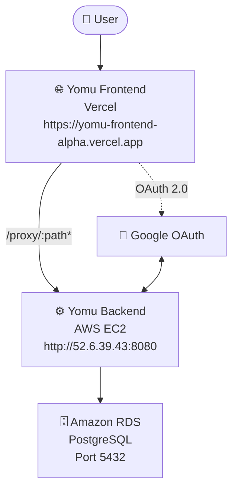
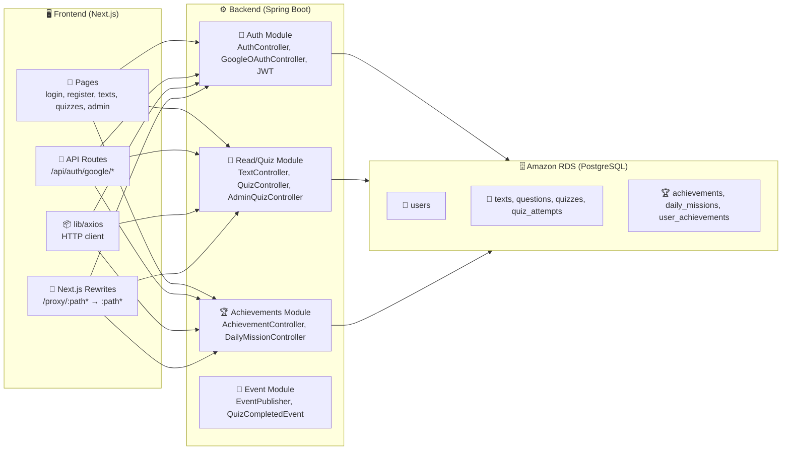
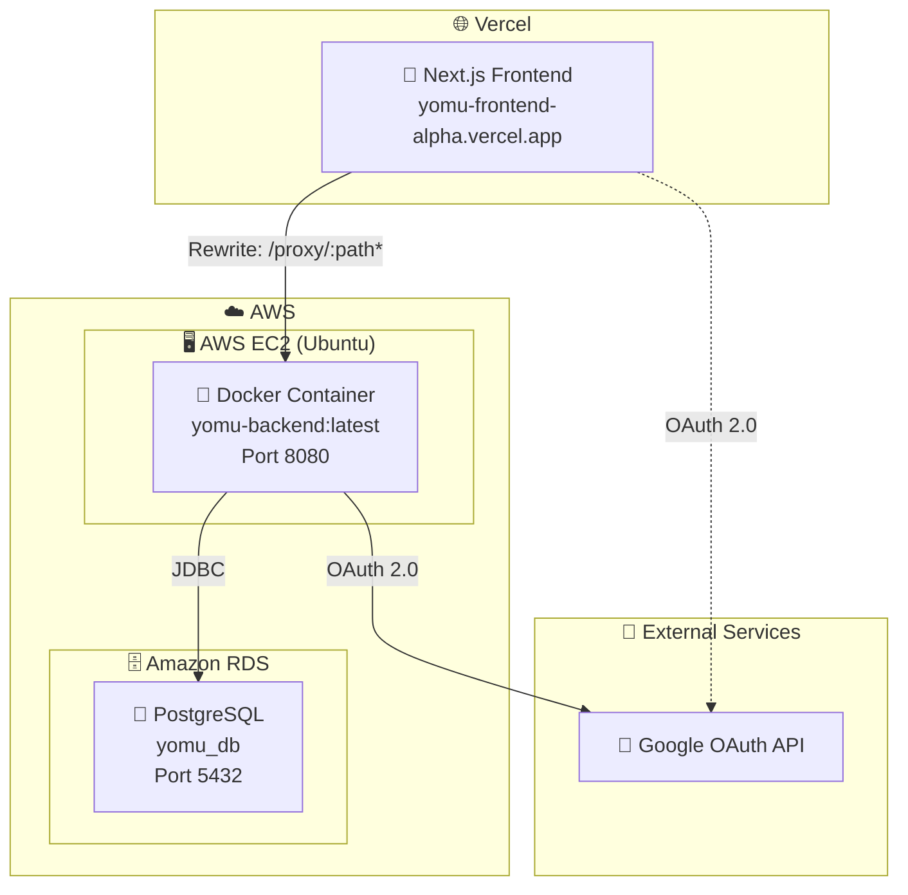

# Software Architectures Yomu B17

> Documentation Date: 2026-05-12
> Current State (reflects actual codebase and production deployment)

---

## System Context Diagram

| Component | Description |
|-----------|-------------|
| **User** | End user accessing Yomu via web browser |
| **Yomu Frontend** | Next.js app deployed on Vercel, handles UI and proxies API calls |
| **Yomu Backend** | Spring Boot REST API deployed on AWS EC2 (Docker container), handles auth, reads, quizzes, achievements |
| **Amazon RDS** | PostgreSQL database, endpoint stored in GitHub Secrets |
| **Google OAuth** | External identity provider for SSO login |

---

## Container Diagram

| Module | Responsibilities | Key Classes |
|--------|------------------|-------------|
| **Auth Module** | Login, register, JWT generation, Google OAuth flow | `AuthController`, `GoogleOAuthController`, `JwtUtils`, `JwtAuthFilter`, `UserRepository`, `User` entity |
| **Read/Quiz Module** | Reading texts, quiz attempts, grading, admin question management | `TextController`, `QuizController`, `AdminQuizController`, `QuizServiceImpl`, `Text`, `Quiz`, `Question` models |
| **Achievements Module** | Achievement tracking, daily missions, user progress | `AchievementController`, `DailyMissionController`, `AchievementServiceImpl`, `UserAchievement`, `DailyMission` entities |
| **Event Module** | Publishes `QuizCompletedEvent` when quiz is graded (Spring `ApplicationEventPublisher`, no external broker) | `EventPublisher`, `QuizCompletedEvent` |
| **API Routes (FE)** | Google OAuth callback handler | `/api/auth/google/route.ts`, `/api/auth/google/callback/route.ts` |
| **Next.js Rewrites** | Proxies `/proxy/:path*` → `http://52.6.39.43:8080/:path*` to hide backend URL | `next.config.ts` rewrites |
| **HTTP Client (FE)** | Axios instance configured with base URL `/proxy` | `lib/axios` |

---

## Deployment Diagram

| Environment | Component | URL | Notes |
|-------------|----------|-----|-------|
| **Production** | Next.js Frontend (Vercel) | `https://yomu-frontend-alpha.vercel.app` | Auto-deploys on push to main |
| **Production** | Spring Boot Backend (EC2) | `http://52.6.39.43:8080` | Docker container, direct public IP |
| **Production** | Amazon RDS | RDS endpoint via GitHub Secrets | PostgreSQL 5432, credentials in GitHub Secrets |
| **External** | Google OAuth API | `accounts.google.com` | SSO login, credentials in GitHub Secrets |

---