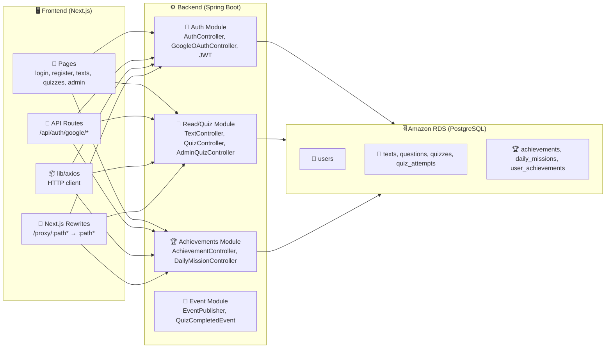
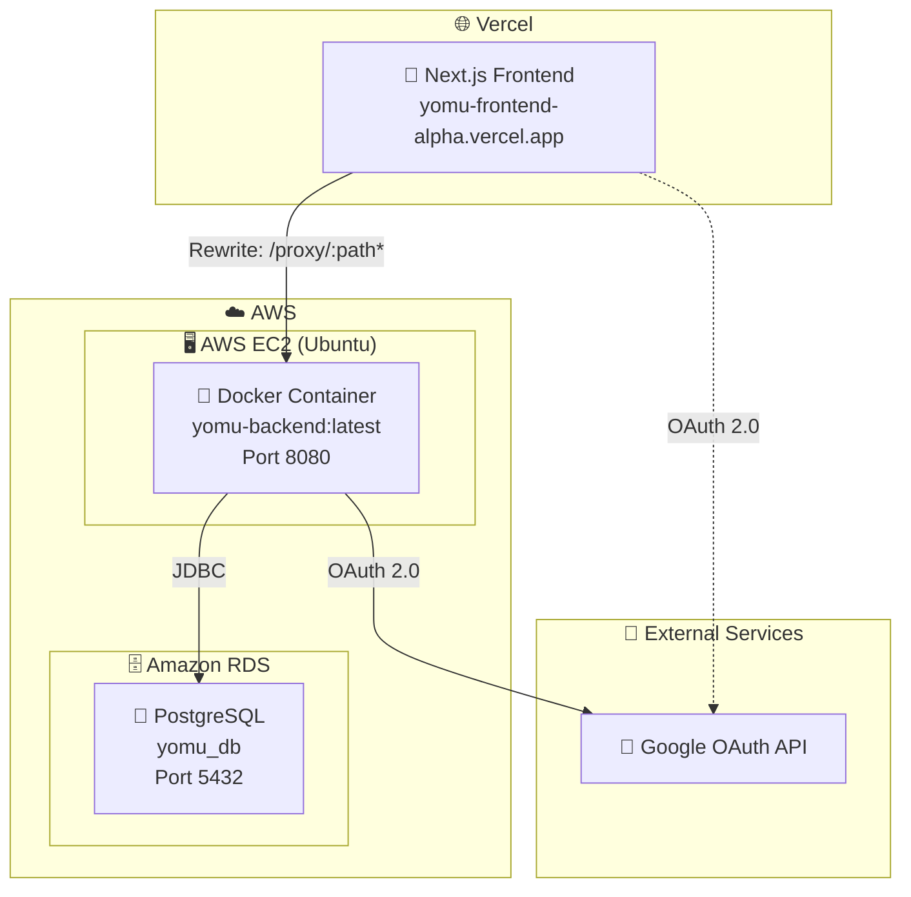
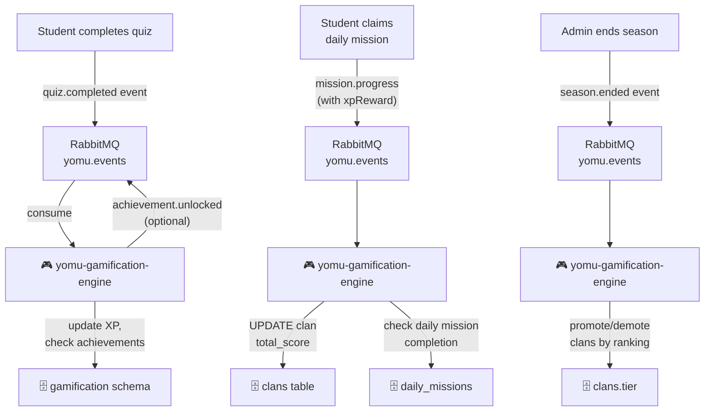

# Software Architectures Yomu B17

---

## System Context Diagram

| Component | Description |
|-----------|-------------|
| **User** | End user accessing Yomu via web browser |
| **Yomu Frontend** | Next.js app deployed on Vercel, handles UI and proxies API calls |
| **Yomu Backend** | Spring Boot REST API deployed on AWS EC2 (Docker container), handles auth, reads, quizzes, achievements |
| **Amazon RDS** | PostgreSQL database, endpoint stored in GitHub Secrets |
| **Google OAuth** | External identity provider for SSO login |

---

## Container Diagram

| Module | Responsibilities | Key Classes |
|--------|------------------|-------------|
| **Auth Module** | Login, register, JWT generation, Google OAuth flow | `AuthController`, `GoogleOAuthController`, `JwtUtils`, `JwtAuthFilter`, `UserRepository`, `User` entity |
| **Read/Quiz Module** | Reading texts, quiz attempts, grading, admin question management | `TextController`, `QuizController`, `AdminQuizController`, `QuizServiceImpl`, `Text`, `Quiz`, `Question` models |
| **Achievements Module** | Achievement tracking, daily missions, user progress | `AchievementController`, `DailyMissionController`, `AchievementServiceImpl`, `UserAchievement`, `DailyMission` entities |
| **Event Module** | Publishes `QuizCompletedEvent` when quiz is graded (Spring `ApplicationEventPublisher`, no external broker) | `EventPublisher`, `QuizCompletedEvent` |
| **API Routes (FE)** | Google OAuth callback handler | `/api/auth/google/route.ts`, `/api/auth/google/callback/route.ts` |
| **Next.js Rewrites** | Proxies `/proxy/:path*` → `http://52.6.39.43:8080/:path*` to hide backend URL | `next.config.ts` rewrites |
| **HTTP Client (FE)** | Axios instance configured with base URL `/proxy` | `lib/axios` |

---

## Deployment Diagram

| Environment | Component | URL | Notes |
|-------------|----------|-----|-------|
| **Production** | Next.js Frontend (Vercel) | `https://yomu-frontend-alpha.vercel.app` | Auto-deploys on push to main |
| **Production** | Spring Boot Backend (EC2) | `http://52.6.39.43:8080` | Docker container, direct public IP |
| **Production** | Amazon RDS | RDS endpoint via GitHub Secrets | PostgreSQL 5432, credentials in GitHub Secrets |
| **External** | Google OAuth API | `accounts.google.com` | SSO login, credentials in GitHub Secrets |

---

## Future Software Architecture

### Future Container Diagram

```mermaid
graph LR
    subgraph Frontend["🖥️ Frontend (Next.js) - Vercel"]
        FE1["📄 Pages<br/>login, register, texts, quizzes, admin"]
        FE2["🔌 API Routes<br/>/api/auth/google/*"]
        FE3["📦 lib/axios<br/>HTTP client"]
        FE4["🔄 Next.js Rewrites<br/>/proxy/:path* → :path*"]
    end

    subgraph Gateway["🚪 yomu-gateway (Railway) - Spring Cloud Gateway"]
        GW1["🔐 JWT Auth Filter<br/>Validate token, inject X-User-Id headers"]
        GW2["🛣️ Route Config<br/>/api/auth → core-api<br/>/api/** → core-api<br/>/admin/** → core-api"]
        GW3["🌐 CORS Config<br/>Allow Vercel origin only"]
    end

    subgraph CoreAPI["⚙️ yomu-core-api (Railway) - Spring Boot"]
        CBE1["🔐 Auth Module<br/>Login, register, Google OAuth"]
        CBE2["📖 Read/Quiz Module<br/>TextController, QuizController, AdminQuizController"]
        CBE3["🏆 Achievements Module<br/>Admin CRUD achievements, missions"]
        CBE4["📡 Event Publisher<br/>publishQuizCompleted()<br/>publishMissionProgress()"]
    end

    subgraph GamEngine["🎮 yomu-gamification-engine (Railway) - Rust"]
        GE1["🏆 Achievement Handler<br/>handle_achievement_unlocked()<br/>XP & milestone tracking"]
        GE2["📊 Leaderboard Handler<br/>handle_quiz_completed()<br/>Clan score calculation"]
        GE3["⚡ Buff/Debuff Manager<br/>Auto-activate based on conditions<br/>Tier-strategy scoring"]
        GE4["📅 Season Manager<br/>handle_season_ended()<br/>Promotion/demotion logic"]
        GE5["🗓️ Mission Tracker<br/>handle_mission_progress()<br/>Daily mission state"]
    end

    subgraph Broker["🐇 RabbitMQ - CloudAMQP"]
        EX["📬 Exchange: yomu.events<br/>(topic)"]
    end

    subgraph Storage["🗄️ PostgreSQL - Railway Managed"]
        DB1["📦 auth schema<br/>users, sessions"]
        DB2["📦 quiz schema<br/>readings, questions,<br/>quiz_attempts, completed_readings"]
        DB3["📦 gamification schema<br/>clans, achievements,<br/>daily_missions, buffs, seasons"]
    end

    FE1 & FE2 & FE3 & FE4 --> Gateway
    Gateway --> CoreAPI
    CoreAPI --> |"quiz.completed<br/>mission.progress"| Broker
    Broker --> GamEngine
    GamEngine --> |"achievement.unlocked<br/>mission.progress"| Broker
    CoreAPI --> Storage
    GamEngine --> Storage
```

### Event Flow Summary

### RabbitMQ Events Contract

| Event | Routing Key | Publisher | Consumer | Action |
|-------|-------------|-----------|----------|---------|
| `quiz.completed` | `quiz.completed` | yomu-core-api | yomu-gamification-engine | Update XP, check achievements, update clan score |
| `mission.progress` | `mission.progress` | yomu-core-api | yomu-gamification-engine | Update daily mission state, add XP to clan if member |
| `achievement.unlocked` | `achievement.unlocked` | yomu-gamification-engine | yomu-core-api (optional) | Store notification |
| `season.ended` | `season.ended` | yomu-core-api (admin) | yomu-gamification-engine | Promote/demote clans per ranking |

### Planned Repositories

| Repo | Tech Stack | Hosting | Responsibility |
|------|-----------|---------|----------------|
| `yomu-infra` | Docker Compose + SQL scripts | Local dev only | RabbitMQ bootstrap, DB schema init scripts |
| `yomu-gateway` | Java 17, Spring Cloud Gateway | Railway | JWT auth, CORS, routing to core-api |
| `yomu-core-api` | Java 21, Spring Boot | Railway | Auth, readings, quizzes, achievements admin, event publishing |
| `yomu-gamification-engine` | Rust, SQLx | Railway | Achievement unlocks, leaderboard, clan scores, buffs/debuffs, missions, seasons |
| `yomu-web` | Next.js | Vercel | Existing frontend (no change) |

### Environment Variables (Future)

| Variable | Service | Notes |
|----------|---------|-------|
| `JWT_SECRET` | yomu-gateway | Min 32 chars, HS256 key |
| `CLOUDAMQP_URL` | yomu-gateway, yomu-core-api, yomu-gamification-engine | RabbitMQ connection string |
| `YOMU_WEB_URL` | yomu-gateway | Frontend URL for CORS |
| `CORE_API_URL` | yomu-gateway | Internal URL to yomu-core-api |
| `DATABASE_URL` | yomu-core-api, yomu-gamification-engine | PostgreSQL connection (Railway managed) |
| `GOOGLE_CLIENT_ID` | yomu-core-api | Google OAuth app client ID |
| `GOOGLE_CLIENT_SECRET` | yomu-core-api | Google OAuth app secret |
| `GOOGLE_REDIRECT_URI` | yomu-core-api | `https://yomu-gateway-url/api/auth/google/callback` |

### Module Responsibilities (Future)

| Module | Service | Responsibilities |
|--------|---------|-----------------|
| **Auth Module** | yomu-core-api | Login, register, Google OAuth, JWT generation |
| **Read/Quiz Module** | yomu-core-api | Reading CRUD, quiz submission, grading, publish `quiz.completed` event |
| **Achievements Module** | yomu-core-api | Admin CRUD achievements/missions, claim mission reward, publish `mission.progress` event |
| **Gamification Engine** | yomu-gamification-engine | All gamification logic: XP, leaderboard, clan scores, buffs/debuffs, achievement unlocks, season management |
| **Gateway** | yomu-gateway | JWT validation, forward user claims via `X-User-Id`, `X-User-Role` headers, CORS |

### Implementation Order

1. **yomu-infra** — RabbitMQ compose + SQL schemas + events contract
2. **yomu-gateway** — Spring Cloud Gateway with JWT filter and routing
3. **yomu-core-api** — Refactor existing backend into core-api service, add event publishing
4. **yomu-gamification-engine** — Rust service for gamification logic
5. **Vercel proxy update** — Change rewrite destination from EC2 IP to Railway gateway URL