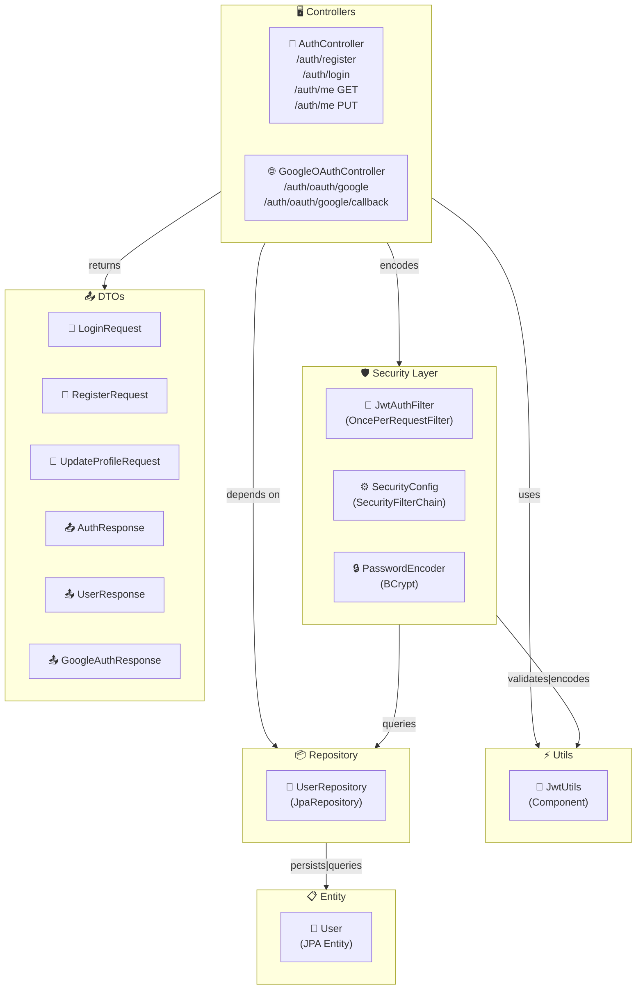
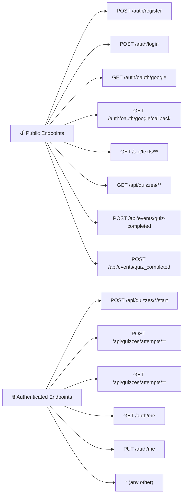
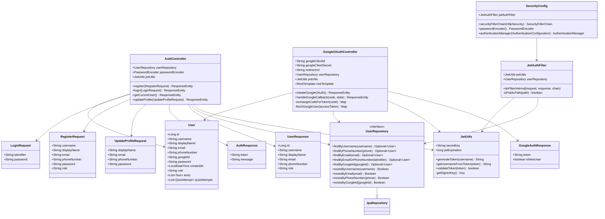

# Auth Module — Component & Code Architecture

---

## PART 1: Component Diagrams

### Component Overview

> High-level view of the auth module as interconnected subsystems.

### Security Configuration — Endpoint Access Map

> Which endpoints are public vs authenticated.

---

## PART 2: Code Diagrams

### Class Diagram

> Structural relationships between all auth module classes and their members.

---

## Class Diagram

---
