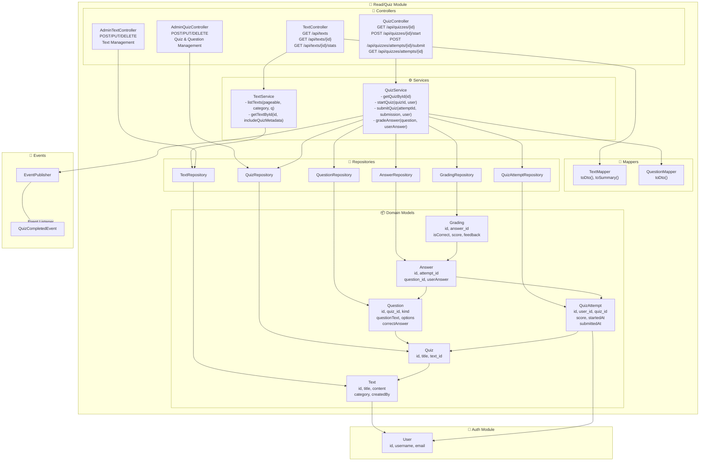
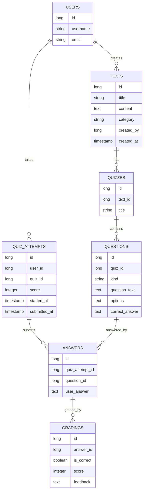
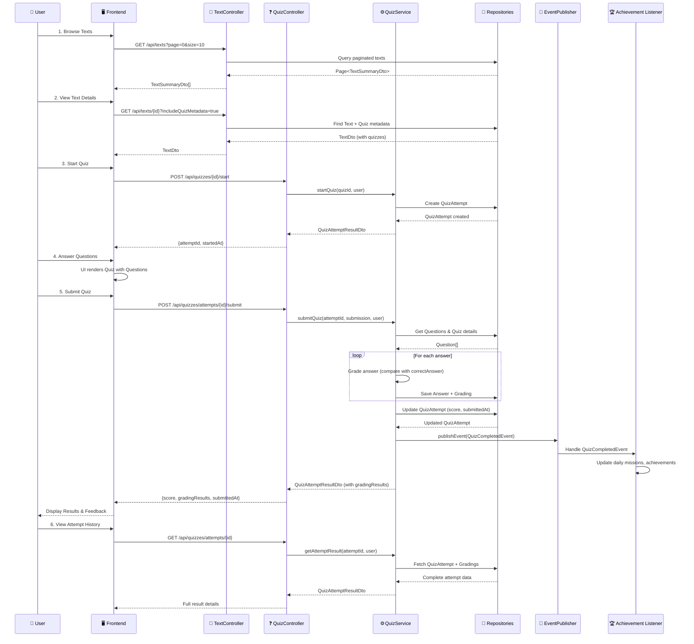
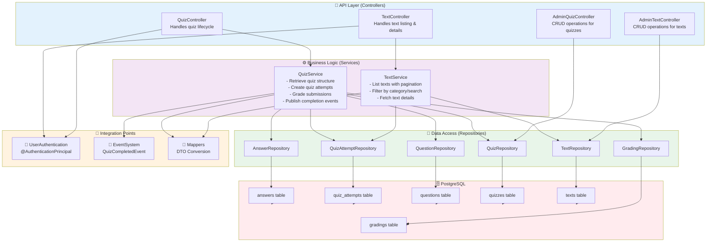

# Reading & Quiz Feature - Architectural Diagrams

## Component Diagram

```mermaid
graph TB
    subgraph ReadQuizModule["📖 Read/Quiz Module"]
        subgraph Controllers["🎯 Controllers"]
            TC["TextController<br/>GET /api/texts<br/>GET /api/texts/{id}<br/>GET /api/texts/{id}/stats"]
            QC["QuizController<br/>GET /api/quizzes/{id}<br/>POST /api/quizzes/{id}/start<br/>POST /api/quizzes/attempts/{id}/submit<br/>GET /api/quizzes/attempts/{id}"]
            ATC["AdminTextController<br/>POST/PUT/DELETE<br/>Text Management"]
            AQC["AdminQuizController<br/>POST/PUT/DELETE<br/>Quiz & Question Management"]
        end

        subgraph Services["⚙️ Services"]
            TS["TextService<br/>- listTexts(pageable, category, q)<br/>- getTextById(id, includeQuizMetadata)"]
            QS["QuizService<br/>- getQuizById(id)<br/>- startQuiz(quizId, user)<br/>- submitQuiz(attemptId, submission, user)<br/>- gradeAnswer(question, userAnswer)"]
        end

        subgraph Mappers["🔄 Mappers"]
            TM["TextMapper<br/>toDto(), toSummary()"]
            QM["QuestionMapper<br/>toDto()"]
        end

        subgraph Repositories["💾 Repositories"]
            TR["TextRepository"]
            QZR["QuizRepository"]
            QSR["QuestionRepository"]
            QAR["QuizAttemptRepository"]
            ANR["AnswerRepository"]
            GR["GradingRepository"]
        end

        subgraph Models["📦 Domain Models"]
            Text["Text<br/>id, title, content<br/>category, createdBy"]
            Quiz["Quiz<br/>id, title, text_id"]
            Question["Question<br/>id, quiz_id, kind<br/>questionText, options<br/>correctAnswer"]
            QuizAttempt["QuizAttempt<br/>id, user_id, quiz_id<br/>score, startedAt<br/>submittedAt"]
            Answer["Answer<br/>id, attempt_id<br/>question_id, userAnswer"]
            Grading["Grading<br/>id, answer_id<br/>isCorrect, score, feedback"]
        end
    end

    subgraph Auth["🔐 Auth Module"]
        User["User<br/>id, username, email"]
    end

    subgraph Events["📡 Events"]
        EP["EventPublisher"]
        QCE["QuizCompletedEvent"]
    end

    TC --> TS --> TR
    TC --> TM
    QC --> QS
    ATC --> TR
    AQC --> QZR
    
    QS --> QZR
    QS --> QSR
    QS --> QAR
    QS --> ANR
    QS --> GR
    QS --> QM
    
    TR --> Text
    QZR --> Quiz
    QSR --> Question
    QAR --> QuizAttempt
    ANR --> Answer
    GR --> Grading
    
    Text --> User
    Quiz --> Text
    Question --> Quiz
    QuizAttempt --> User
    QuizAttempt --> Quiz
    Answer --> QuizAttempt
    Answer --> Question
    Grading --> Answer
    
    QS --> EP
    EP --> QCE
    QCE -.-> |"Event Listener"| Events
```

---

## Entity Relationship Diagram

```mermaid
erDiagram
    USERS ||--o{ TEXTS : creates
    USERS ||--o{ QUIZ_ATTEMPTS : takes
    TEXTS ||--o{ QUIZZES : has
    QUIZZES ||--o{ QUESTIONS : contains
    QUIZ_ATTEMPTS ||--o{ ANSWERS : submits
    QUESTIONS ||--o{ ANSWERS : answered_by
    ANSWERS ||--o{ GRADINGS : graded_by

    USERS {
        long id
        string username
        string email
    }

    TEXTS {
        long id
        string title
        text content
        string category
        long created_by
        timestamp created_at
    }

    QUIZZES {
        long id
        long text_id
        string title
    }

    QUESTIONS {
        long id
        long quiz_id
        string kind
        text question_text
        text options
        text correct_answer
    }

    QUIZ_ATTEMPTS {
        long id
        long user_id
        long quiz_id
        integer score
        timestamp started_at
        timestamp submitted_at
    }

    ANSWERS {
        long id
        long quiz_attempt_id
        long question_id
        text user_answer
    }

    GRADINGS {
        long id
        long answer_id
        boolean is_correct
        integer score
        text feedback
    }
```

---

## Quiz Taking Flow Diagram

```mermaid
sequenceDiagram
    participant User as 👤 User
    participant Frontend as 🖥️ Frontend
    participant TextCtrl as 📖 TextController
    participant QuizCtrl as ❓ QuizController
    participant QuizSvc as ⚙️ QuizService
    participant Repos as 💾 Repositories
    participant EventPub as 📡 EventPublisher
    participant Achievements as 🏆 Achievement Listener

    User->>Frontend: 1. Browse Texts
    Frontend->>TextCtrl: GET /api/texts?page=0&size=10
    TextCtrl->>Repos: Query paginated texts
    Repos-->>TextCtrl: Page<TextSummaryDto>
    TextCtrl-->>Frontend: TextSummaryDto[]

    User->>Frontend: 2. View Text Details
    Frontend->>TextCtrl: GET /api/texts/{id}?includeQuizMetadata=true
    TextCtrl->>Repos: Find Text + Quiz metadata
    Repos-->>TextCtrl: TextDto (with quizzes)
    TextCtrl-->>Frontend: TextDto

    User->>Frontend: 3. Start Quiz
    Frontend->>QuizCtrl: POST /api/quizzes/{id}/start
    QuizCtrl->>QuizSvc: startQuiz(quizId, user)
    QuizSvc->>Repos: Create QuizAttempt
    Repos-->>QuizSvc: QuizAttempt created
    QuizSvc-->>QuizCtrl: QuizAttemptResultDto
    QuizCtrl-->>Frontend: {attemptId, startedAt}

    User->>Frontend: 4. Answer Questions
    Frontend->>Frontend: UI renders Quiz with Questions

    User->>Frontend: 5. Submit Quiz
    Frontend->>QuizCtrl: POST /api/quizzes/attempts/{id}/submit
    QuizCtrl->>QuizSvc: submitQuiz(attemptId, submission, user)
    
    QuizSvc->>Repos: Get Questions & Quiz details
    Repos-->>QuizSvc: Question[]
    
    loop For each answer
        QuizSvc->>QuizSvc: Grade answer (compare with correctAnswer)
        QuizSvc->>Repos: Save Answer + Grading
    end
    
    QuizSvc->>Repos: Update QuizAttempt (score, submittedAt)
    Repos-->>QuizSvc: Updated QuizAttempt
    
    QuizSvc->>EventPub: publishEvent(QuizCompletedEvent)
    EventPub->>Achievements: Handle QuizCompletedEvent
    Achievements->>Achievements: Update daily missions, achievements
    
    QuizSvc-->>QuizCtrl: QuizAttemptResultDto (with gradingResults)
    QuizCtrl-->>Frontend: {score, gradingResults, submittedAt}
    Frontend-->>User: Display Results & Feedback

    User->>Frontend: 6. View Attempt History
    Frontend->>QuizCtrl: GET /api/quizzes/attempts/{id}
    QuizCtrl->>QuizSvc: getAttemptResult(attemptId, user)
    QuizSvc->>Repos: Fetch QuizAttempt + Gradings
    Repos-->>QuizSvc: Complete attempt data
    QuizSvc-->>QuizCtrl: QuizAttemptResultDto
    QuizCtrl-->>Frontend: Full result details
```

---

## Service Architecture & Data Flow

```mermaid
graph TB
    subgraph APILayer["🎯 API Layer (Controllers)"]
        TC["TextController<br/>Handles text listing & details"]
        QC["QuizController<br/>Handles quiz lifecycle"]
        ATC["AdminTextController<br/>CRUD operations for texts"]
        AQC["AdminQuizController<br/>CRUD operations for quizzes"]
    end

    subgraph BusinessLogic["⚙️ Business Logic (Services)"]
        TS["TextService<br/>- List texts with pagination<br/>- Filter by category/search<br/>- Fetch text details"]
        QS["QuizService<br/>- Retrieve quiz structure<br/>- Create quiz attempts<br/>- Grade submissions<br/>- Publish completion events"]
    end

    subgraph DataAccess["💾 Data Access (Repositories)"]
        TR["TextRepository"]
        QR["QuizRepository"]
        QesR["QuestionRepository"]
        QAR["QuizAttemptRepository"]
        AR["AnswerRepository"]
        GR["GradingRepository"]
    end

    subgraph Integration["🔗 Integration Points"]
        UserAuth["👤 UserAuthentication<br/>@AuthenticationPrincipal"]
        EventSys["📡 EventSystem<br/>QuizCompletedEvent"]
        Mapper["🔄 Mappers<br/>DTO Conversion"]
    end

    subgraph Database["🗄️ PostgreSQL"]
        TextsTbl["texts table"]
        QuizzesTbl["quizzes table"]
        QuestionsTbl["questions table"]
        AttemptsTab["quiz_attempts table"]
        AnswersTbl["answers table"]
        GradingsTbl["gradings table"]
    end

    TC --> TS
    ATC --> TR
    AQC --> QR
    QC --> QS
    
    TS --> Mapper
    QS --> Mapper
    
    TS --> TR
    TS --> QAR
    
    QS --> QR
    QS --> QesR
    QS --> QAR
    QS --> AR
    QS --> GR
    
    QC --> UserAuth
    TC --> UserAuth
    
    QS --> EventSys
    
    TR --> TextsTbl
    QR --> QuizzesTbl
    QesR --> QuestionsTbl
    QAR --> AttemptsTab
    AR --> AnswersTbl
    GR --> GradingsTbl
    
    TextsTbl --> Database
    QuizzesTbl --> Database
    QuestionsTbl --> Database
    AttemptsTab --> Database
    AnswersTbl --> Database
    GradingsTbl --> Database
    
    style APILayer fill:#E3F2FD
    style BusinessLogic fill:#F3E5F5
    style DataAccess fill:#E8F5E9
    style Integration fill:#FFF3E0
    style Database fill:#FFEBEE
```